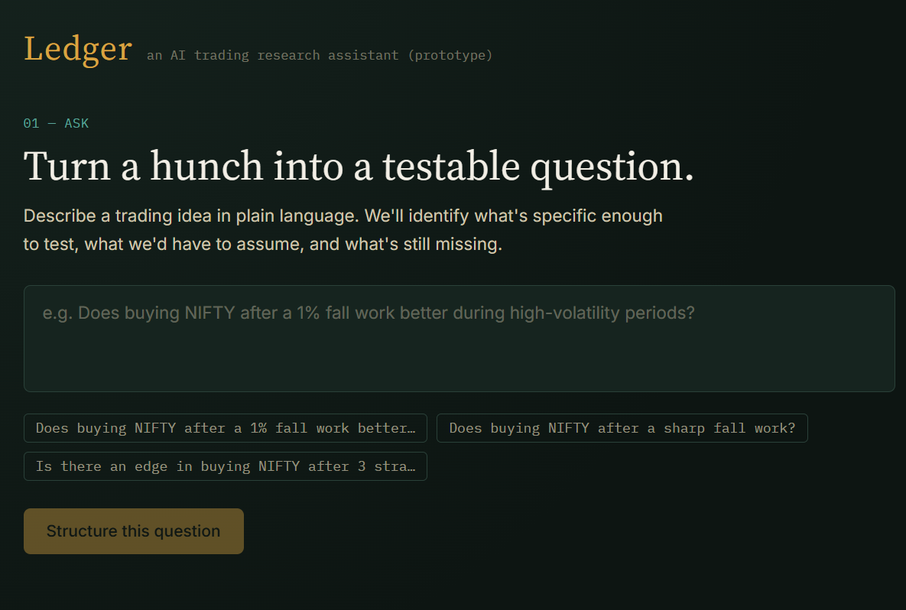
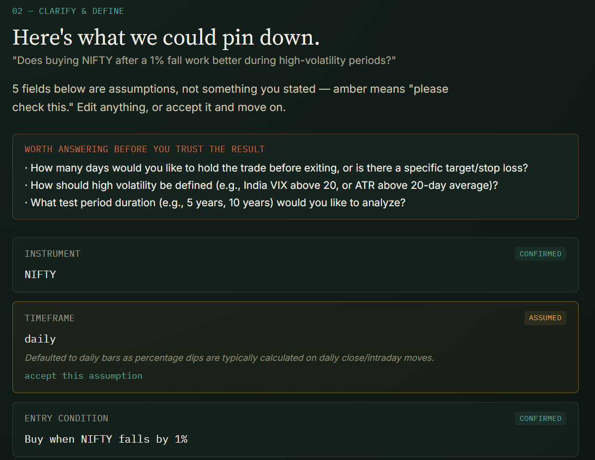
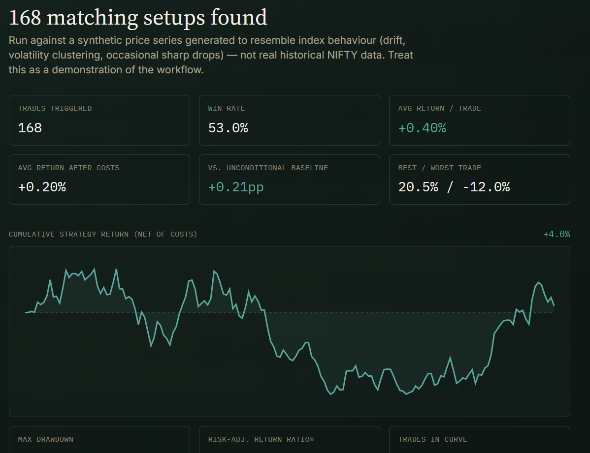

# 📒 Ledger — AI Trading Research Assistant

> Turn a natural-language trading question into a structured, testable experiment — and watch it run end-to-end against simulated data.

[](https://nifty-research-assistant-nu.vercel.app/)
[](https://nifty-research-assistant-nu.vercel.app/)

**Live demo:** [nifty-research-assistant-nu.vercel.app](https://nifty-research-assistant-nu.vercel.app/)

---

## 📸 Screenshots

| Ask | Clarify & Define | Results |
|---|---|---|
|  |  |  |

---

## Overview

Ledger is a mini prototype (built in a scoped 3–4 hour assignment window) that walks a user through the full research loop a quant analyst goes through informally in their head:

**Ask → Clarify → Define → Test → Learn**

Instead of a single open-ended chatbot that "does everything," Ledger splits the workflow into two narrow, purpose-built AI calls plus deterministic application code in between — so the AI extracts and explains, while plain TypeScript computes.

## ✨ Live Flow

| Step | What happens |
|---|---|
| **1. Ask** | User types a question in plain English, e.g. *"Does buying NIFTY after a 1% fall work better during high-volatility periods?"* |
| **2. Clarify & Define** | Gemini extracts a structured experiment (instrument, entry, filter, exit, holding period, test period, cost assumption). Every field is tagged **confirmed** (stated by the user) or **assumed** (the model's best guess, shown with its reasoning) — nothing is silently invented. The user can edit or accept any field. |
| **3. Test** | The confirmed experiment runs against a synthetic, reproducible price series (see *Key Decisions*) using a small deterministic backtest engine. |
| **4. Learn** | Gemini explains the result in plain language, explicitly separating *what the data shows* (facts) from *what we conclude* (interpretation), plus a short list of ways the result could be misleading. |
| **5. Remember** | Past experiments persist locally in browser storage, so a user can revisit earlier questions — a small nod toward the "remember what it learned" part of the longer-term product vision. |

## 🏗️ Architecture

```
app/
  page.tsx               orchestrates the ASK → CLARIFY → RESULTS state machine
  api/parse/route.ts     AI call #1: question → structured Experiment JSON
  api/explain/route.ts   AI call #2: backtest stats → plain-language explanation
components/
  QuestionAsk.tsx         step 1 UI
  ClarifyDefine.tsx        step 2 UI (editable structured fields)
  ResultsPanel.tsx         step 3/4 UI (stats + explanation)
  HistoryList.tsx           step 5 UI (localStorage history)
lib/
  experimentSchema.ts     shared TypeScript types for the structured experiment
  mockData.ts               synthetic price series generator (seeded PRNG)
  backtest.ts                deterministic backtest engine
```

Two separate, narrowly-scoped AI calls, not one open-ended chatbot loop:

- **`/api/parse`** — turns free text into strict JSON matching a fixed schema (Gemini's `responseMimeType: "application/json"` mode). Its only job is extraction and flagging assumptions. It never runs the backtest or judges the strategy.
- **`/api/explain`** — takes the *computed* backtest numbers (produced by plain TypeScript, not the model) and writes a short, honest explanation of them. The model never invents numbers; it only interprets numbers it's given.

Everything else — the structured-field UI, the backtest engine, the history list — is deterministic application code. This was deliberate: the goal was AI used *meaningfully*, not a thin wrapper where every step is just another prompt.

## 🛠️ Tech Stack

| Layer | Choice | Why |
|---|---|---|
| Framework | **Next.js 16 (App Router) + TypeScript** | API routes double as a thin backend, keeping the Gemini API key server-side only |
| Styling | **Tailwind CSS** | Small custom token set (`tailwind.config.ts`) for a "research ledger" visual identity rather than default component-kit styling |
| AI | **Google Gemini API** (`gemini-3.6-flash`, free tier via [Google AI Studio](https://aistudio.google.com/apikey)) | Powers the two structured AI calls above using `responseMimeType: "application/json"` for reliable output |
| Validation | **Zod** | Runtime validation of both AI responses — a system prompt is not a contract; `lib/experimentValidation.ts` is the actual enforcement point, rejecting malformed or out-of-range output before it reaches the UI or backtest engine |
| Persistence | **Browser `localStorage`** | Lightweight history persistence — no database needed for a prototype of this scope |

## 🧭 Key Decisions

- **Simulated data, clearly labeled.** No live market feed was in scope for a 3–4 hour prototype, and the brief explicitly allows simulated/mock data. Rather than hardcode a handful of fake numbers, a small seeded generator produces index-like behavior (drift, volatility clustering, fat-tailed drops) so rules like "falls 1%" and filters like "high volatility" have something realistic to act on. The UI never claims this is real NIFTY history.
- **Assumptions are visible, not hidden.** Every field the model didn't get from the question is shown as "assumed," with a one-line reason, and requires either an edit or an explicit accept — the most carefully built part of the UI, since handling ambiguity well was the top priority.
- **Data vs. interpretation, kept structurally separate.** "What the data shows" and "what we conclude" are two different fields in the AI's JSON response, not one paragraph, so the UI can never accidentally blend them.
- **Backtest results are saved independently of the AI explanation.** History is persisted as soon as the deterministic, local backtest completes — not gated behind the second Gemini call succeeding — so a transient AI outage can't lose a result that already finished computing.
- **No database.** `localStorage` is enough to demonstrate "remember what it learned" without adding infrastructure that isn't the point of the assignment.

## 🚀 Running Locally

```bash
git clone https://github.com/Aarya0706/nifty-research-assistant.git
cd nifty-research-assistant
npm install
cp .env.example .env.local   # add your free GEMINI_API_KEY (aistudio.google.com/apikey)
npm run dev
```

Then open [http://localhost:3000](http://localhost:3000).

## 🔭 What I'd Improve With More Time

- **Automated tests** around the backtest engine (threshold behavior, holding period, volatility filter, cost calculation, zero-trade edge cases) and the Zod schemas — none exist yet; for a 3–4 hour prototype the end-to-end workflow was prioritized over coverage, but this is the most defensible next investment.
- **Statistical rigor in the results.** "53% win rate over 234 trades" is currently presented without a confidence interval — a bootstrap CI, or at minimum a sample-size caveat, would make the difference between 60% on 10 trades and 60% on 1,000 trades explicit rather than implied.
- **Richer backtest statistics** — Sharpe ratio, max drawdown, an equity curve — instead of just avg return / win rate / best-worst. Kept minimal since the assignment is scoped around the research *workflow*, not backtest sophistication.
- **Real historical data.** Swap the synthetic generator for a real dataset (e.g. a public NIFTY daily-close CSV) behind the same backtest interface — the engine is already written against a generic `DailyBar[]`, so this is a data-layer swap, not a rewrite.
- **Follow-up questions.** Let a user ask "what if holding period were 10 days instead?" against an existing result without re-typing the whole question — re-run the same experiment object with one field changed.
- **Server-side history**, once there's a reason to have accounts, instead of per-browser storage.

## 📄 About

Built by [Aarya Shirsath](https://github.com/Aarya0706) as a scoped prototype for the assignment: *AI Trading Research Assistant — Option 1*.

- **Live:** [nifty-research-assistant-nu.vercel.app](https://nifty-research-assistant-nu.vercel.app/)
- **AI usage notes:** see [`AI_USAGE_NOTE.md`](./AI_USAGE_NOTE.md)
